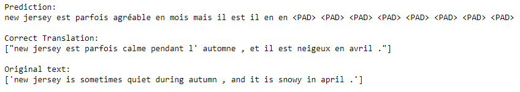

# Natural Language Processing

Code and document samples generated while following Udacity's [Natural Language Processing Nanodegree](https://d20vrrgs8k4bvw.cloudfront.net/documents/en-US/NLP+Nanodegree+Syllabus.pdf) Program. 💬🎇⚡

## Nanodegree Content
Natural Language Processing Nanodegree is composed of 3 modules each with a project associated. 

### 1. Introduction to Natural Language Processing
This part covers fundamentals of Natural Language Processing through symbolic manipulation, including text cleaning, normalization, and tokenization. You'll
then build a part of speech tagger using hidden Markov models.
- Prepare text obtained from different sources for further processing, by cleaning, normalizing and splitting it into individual words or tokens
- Build a spam e-mail classifier using the naive Bayes algorithm
- Overview of several part-of-speech tagging methods including a deeper dive on hidden Markov models
- [Part of Speech Tagging](https://github.com/Idilismiguzel/Part-of-Speech-Tagger) is the final project requires building a hidden Markov model for part of speech tagging with a universal tagset. After completing the project it has to be submitted and reviewed by Udacity in order to continue with the Nanodegree and to graduate. 

  

### 2. Computing with Natural Language
This module is the most interesting and challenging one imho which prepares you to build a Machine Translation model.
- Feature extraction and embeddings, transforming text using methods like Bag-of-Words, TF-IDF, Word2Vec and GloVE 
- Topic modeling using Latent Dirichlet Analysis (LDA)
- Sentiment Analysis using several machine learning classifiers including Recurrent Neural Networks to predict the sentiment in text
- Sequence to Sequence a specific architecture of RNNs for generating one sequence from another sequence that is useful for chatbots, machine translation and etc.
- Deep Learning Attention mechanism
- [Machine Translation](https://github.com/Idilismiguzel/Machine-Translation) is the final project that requires to build a language translator. Completed model will accept English text as input and return the French translation. After completing the project it has to be submitted and reviewed by Udacity in order to continue with the Nanodegree and to graduate.

  

### 3. Communicating with Natural Language
This module covers VUI and ASR techiques to build speech recognizer.
- Voice User Interfaces and introduction to Alexa skills
- Alexa History Skill Build your own Alexa skill and deploy it -- optional
- Speech Recognition and ASR pipelines
- [DNN Speech Recognizer](https://github.com/Idilismiguzel/DeepNN-Speech-Recognizer) is the final project of the course and also the Nanodegree, requiring to build a deep neural network that functions as part of an end-to-end automatic speech recognition (ASR) pipeline. Also this project has to be submitted and reviewed by Udacity.

  

